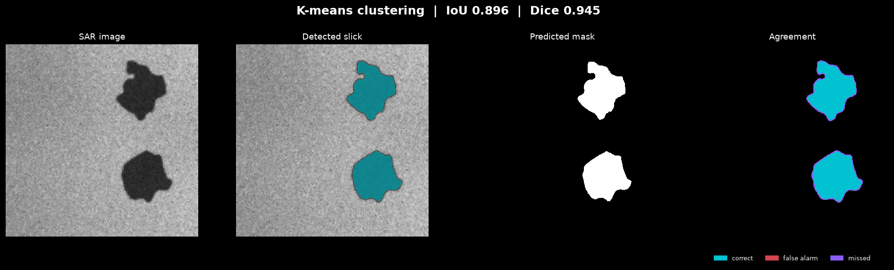
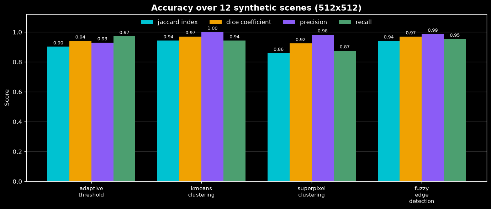
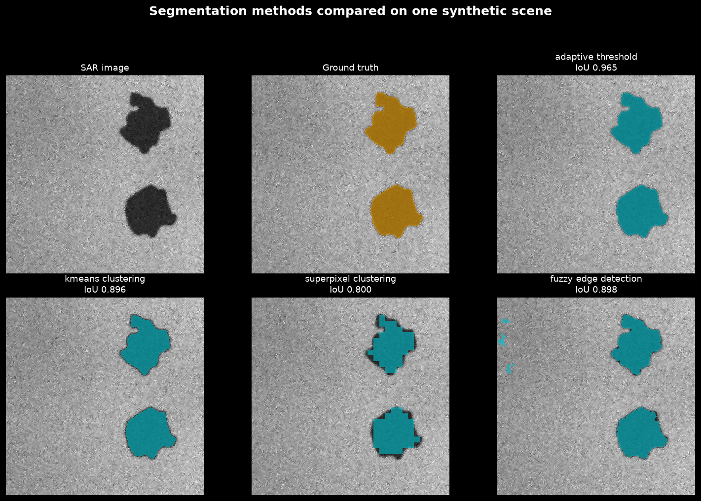
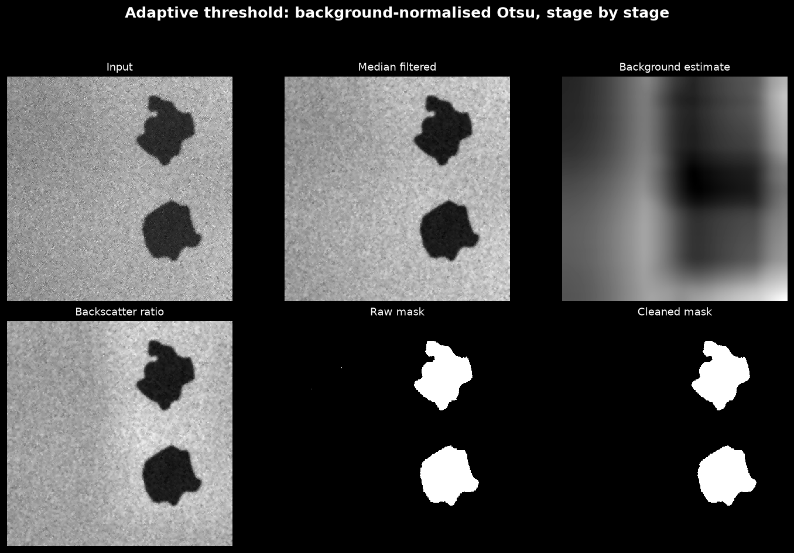
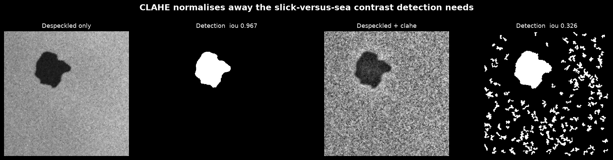
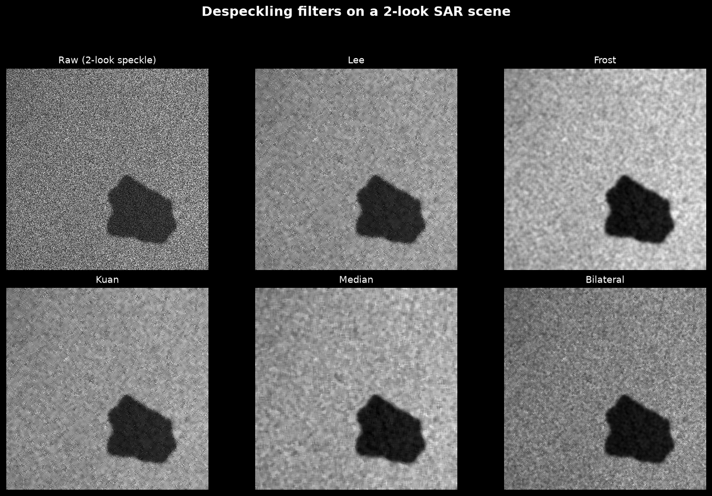
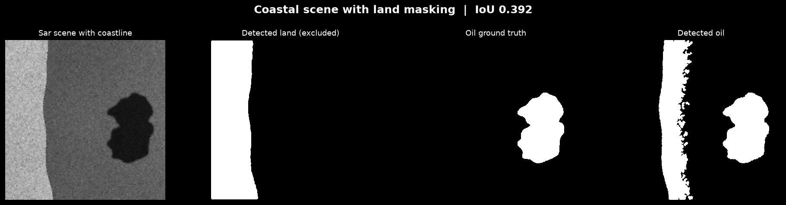

# SAR Oil Spill Detection

[](https://github.com/aaronseq12/SAR-MATLAB-Oil-spill-dectection/actions/workflows/ci.yml)
[](https://python.org)
[](LICENSE)
[](https://docs.astral.sh/ruff/)

Detect and segment oil spills in Synthetic Aperture Radar (SAR) satellite
imagery. A Python port and substantial rework of an original MATLAB research
project, which is still included under [`matlab/`](matlab/).



## Why SAR

Oil floating on water damps the short capillary waves that scatter radar energy
back to the satellite. A slick therefore returns **less** energy than the sea
around it and appears as a dark, unusually smooth patch. Radar supplies its own
illumination and passes through cloud, so this works at night and in the storms
that tend to accompany a spill — which is exactly when optical sensors fail.

Every method here is built on that one observation. They differ only in how
they decide where "dark and smooth" begins.

## Quick start

No dataset and no trained model required — a synthetic SAR generator ships with
the package, so the pipeline runs on a clean clone:

```bash
git clone https://github.com/aaronseq12/SAR-MATLAB-Oil-spill-dectection.git
cd SAR-MATLAB-Oil-spill-dectection

python -m venv .venv && source .venv/bin/activate   # Windows: .venv\Scripts\activate
pip install -e '.[api,dev]'

sar-oil-spill demo --method kmeans_clustering
```

```
==========================================================
                     DETECTION RESULT
==========================================================
  Method               kmeans_clustering
  Oil detected         yes
  Affected area        22,664 px (8.65% of scene)
  Confidence           0.648
  Processing time      479 ms
----------------------------------------------------------
  IoU (Jaccard)        0.896
  Dice                 0.945
  Precision / Recall   1.000 / 0.896
  Boundary F1          0.107
  Pixel accuracy       0.990
==========================================================
```

Other entry points:

```bash
sar-oil-spill detect scene.png --method adaptive_threshold --ground-truth mask.png
sar-oil-spill benchmark --samples 20          # score every method
sar-oil-spill dataset /path/to/dataset        # summarise a dataset on disk

uvicorn api.main:app --reload                 # REST API at :8000/api/docs
streamlit run app.py                          # browser UI
docker compose up --build                     # containerised API
```

## Measured results

Every number below comes from running the code, not from a paper. Reproduce
them with `python scripts/generate_docs_images.py`, which regenerates this
table, the JSON in [`docs/benchmark-results.json`](docs/benchmark-results.json)
and every figure in this README.

**12 synthetic 512×512 scenes, seed 42, single CPU core:**

| Method | IoU | Dice | Precision | Recall | Boundary F1 | Time |
|---|---|---|---|---|---|---|
| **K-means clustering** | **0.943** | **0.970** | 1.000 | 0.943 | 0.482 | 413 ms |
| **Fuzzy edge detection** | 0.941 | 0.969 | 0.987 | 0.953 | 0.733 | 149 ms |
| **Adaptive threshold** | 0.902 | 0.941 | 0.929 | **0.971** | **0.875** | **141 ms** |
| **Superpixel clustering** | 0.859 | 0.924 | 0.982 | 0.875 | 0.287 | 265 ms |



**Read this before quoting the numbers.** They are measured on *synthetic*
scenes whose speckle, slick contrast and wind gradient follow the models in
[`synthetic.py`](src/sar_oil_spill/data/synthetic.py). That makes them a fair
comparison *between methods* and a solid regression test, but it does **not**
predict accuracy on real Sentinel-1 imagery. Real scenes contain look-alikes —
low-wind cells, biogenic films, rain cells, ship wakes — that are genuinely
dark and genuinely smooth, and none of these methods can tell them from oil on
radiometry alone. Expect materially lower scores on real data.

Note the divergence between IoU and boundary F1: K-means wins on area overlap
but scores 0.48 on contours, because clustering assigns whole pixels to the
darkest class and produces a slightly dilated, blocky outline. Adaptive
thresholding is the opposite — a little worse on area, clearly best on edges.
Pick by what your downstream use actually needs.

### The methods, side by side



| Method | How it decides | Best for |
|---|---|---|
| **Adaptive threshold** | Divides by a wide-window background estimate, then Otsu on the ratio | Sharp boundaries; the fastest option |
| **K-means clustering** | Clusters grey levels, takes the darkest cluster | Highest area accuracy; no false alarms |
| **Superpixel clustering** | SLIC superpixels averaged, then Otsu, then distance filtering | Very conservative; heavy speckle |
| **Fuzzy edge detection** | Gaussian fuzzy memberships on image gradients, keeps smooth *and* dark regions | Balanced; exploits texture, not just brightness |

## How the pipeline works



```
raw SAR scene
     │
     ├─ despeckle          Lee / Frost / Kuan / median / bilateral
     ├─ (enhance contrast) OFF by default — see below
     ├─ resize             to the configured target size
     │
     ├─ segment            one of the four methods above
     ├─ (mask land)        bright regions excluded on request
     ├─ clean              morphological opening, hole filling, area filter
     │
     └─ evaluate           IoU, Dice, boundary F1, Hausdorff, object-level rates
```

### Two findings worth knowing

**1. Contrast enhancement destroys detection.** The previous version of this
project applied CLAHE by default and advertised it as an improvement. It is
actively harmful here, and measurably so:



CLAHE equalises contrast *within local tiles*. A slick wider than a tile gets
its interior brightened to match the surrounding sea — the exact signal the
detector depends on. Mean IoU across the benchmark falls from **0.85 to 0.32**.
Enhancement is now off by default and belongs to visualisation, not detection.
`tests/test_segmentation.py` guards the default so it cannot silently return.

**2. A purely local threshold cannot see a large slick.** Thresholding each
pixel against its immediate neighbourhood fails on any slick wider than the
window: the local mean sinks with the slick and the contrast cancels, leaving
only the rim detected (recall 0.009 in the original implementation). The fix is
to estimate the background over a window *much wider* than any plausible slick
and threshold the ratio — which under SAR's multiplicative noise model is the
physically meaningful quantity anyway. Recall went from 0.009 to 0.971.

### Despeckling

Speckle is multiplicative interference inherent to coherent radar, not additive
sensor noise, so it needs SAR-specific adaptive filters:



Lee, Frost and Kuan all steer between "smooth towards the local mean" in
homogeneous areas and "keep the pixel" at edges, using the local coefficient of
variation to decide. All are vectorised over separable box filters, so cost is
independent of window size. (The original implementation looped in Python over
every pixel; on a 512×512 scene that is 262,144 iterations per image.)

### Land

Land is a rough, strong scatterer and reads bright, so it is separable from
both sea and oil. `--mask-land` detects and excludes it:



## Python API

```python
from sar_oil_spill import OilSpillDetector
from sar_oil_spill.data import generate_sar_scene

detector = OilSpillDetector()
scene = generate_sar_scene(size=(512, 512), n_slicks=2, seed=42)

result = detector.detect(
    scene.image,
    method="adaptive_threshold",
    ground_truth=scene.oil_mask,   # optional; enables metrics
    mask_land=False,
)

print(result.oil_detected)              # True
print(result.affected_area_pixels)      # 24451
print(result.metrics.jaccard_index)     # 0.965
print(result.summary())                 # JSON-safe dict

# Compare every method on the same scene
for name, r in detector.compare_methods(scene.image, scene.oil_mask).items():
    print(f"{name:24} IoU {r.metrics.jaccard_index:.3f}")
```

Working with your own data:

```python
import cv2
from sar_oil_spill import OilSpillDetector
from sar_oil_spill.data import SARDatasetHandler

result = OilSpillDetector().detect_from_file("scene.tif", method="kmeans_clustering")
cv2.imwrite("mask.png", result.mask.astype("uint8") * 255)

handler = SARDatasetHandler()
if handler.load_dataset("/path/to/dataset"):
    print(handler.get_dataset_statistics())
    for name, image, truth in handler.iter_samples(limit=10):
        ...
```

Expected dataset layout (`images/` may be JPG while `labels/` is PNG — files
are matched on stem, not full filename):

```
dataset_root/train/
├── images/            labels/
└── images_with_land/  labels_with_land/
```

## REST API

```bash
uvicorn api.main:app --reload      # docs at http://localhost:8000/api/docs
```

| Method | Endpoint | Purpose |
|---|---|---|
| `GET` | `/health` | Liveness probe |
| `GET` | `/api/v1/methods` | List available methods |
| `POST` | `/api/v1/detect` | Detect in one image |
| `POST` | `/api/v1/evaluate` | Detect and score against a reference mask |
| `POST` | `/api/v1/batch-process` | Queue up to 10 images |
| `GET` | `/api/v1/batch-status/{id}` | Poll batch progress |

```python
import base64, requests

with open("scene.png", "rb") as handle:
    response = requests.post(
        "http://localhost:8000/api/v1/detect",
        files={"image_file": handle},
        data={"method": "adaptive_threshold", "mask_land": "false"},
    )

results = response.json()["results"]
print(results["oil_spill_detected"], results["coverage_percent"])

with open("mask.png", "wb") as handle:
    handle.write(base64.b64decode(results["detection_mask_png_base64"]))
```

Detection runs on a worker thread (`asyncio.to_thread`) so a large scene cannot
block the event loop. Uploads are capped at 25 MB and restricted by extension.
See [`deployment/README.md`](deployment/README.md) for the two things to change
before exposing this publicly.

## Deep learning (optional)

An attention-gated U-Net is included but ships **without trained weights** —
there is no pretrained checkpoint in this repository, and the traditional
methods above are what the benchmark measures. PyTorch is an optional extra:

```bash
pip install -e '.[dl]'
```

```python
from sar_oil_spill.models import DeepLearningSegmentation

model = DeepLearningSegmentation(architecture="unet", base_channels=32)
model.create_model()
model.load_checkpoint("models/unet_best.pt")   # you must train this yourself
probabilities = model.predict(image)
```

Without the extra installed, importing it raises an `ImportError` naming the
extra; everything else keeps working.

## Project layout

```
src/sar_oil_spill/         # the installable package
├── config.py              # typed settings loaded from YAML
├── cli.py                 # `sar-oil-spill` entry point
├── core/                  # SAR preprocessing + detection pipeline
├── models/                # traditional methods + optional U-Net
├── data/                  # dataset loader + synthetic scene generator
└── utils/                 # metrics + figure generation
api/                       # FastAPI service
matlab/                    # the original MATLAB implementation
tests/                     # 165 tests
scripts/                   # regenerate documentation figures
docs/                      # figures, MATLAB guide, SAR background
config/model_config.yaml   # runtime configuration
```

## Development

```bash
pip install -e '.[api,dev]'

pytest                                  # 165 tests
pytest --cov=src/sar_oil_spill --cov=api --cov-report=term-missing
ruff check .
mypy src/sar_oil_spill
```

Coverage is **84%** overall as of the last run. The largest gap is
`deep_learning_segmentation.py` at 11%, because PyTorch is not installed in CI;
everything else sits between 79% and 100%.

CI runs the suite on Python 3.10 through 3.13.

## MATLAB original

The original implementation is preserved verbatim in [`matlab/`](matlab/) and
documented in [`docs/MATLAB.md`](docs/MATLAB.md), including a function-by-function
map to the Python port. Background on SAR oil spill sensing is in
[`docs/sar-background.md`](docs/sar-background.md).

## Limitations

- **Synthetic benchmarks only.** No real SAR imagery is bundled, so no accuracy
  claim here transfers to Sentinel-1 or RADARSAT data.
- **Look-alikes are not handled.** Low-wind areas, biogenic films, rain cells
  and wave shadows are dark and smooth too. Distinguishing them needs
  polarimetric features, wind-field data, or a trained classifier — none of
  which are implemented.
- **No georeferencing.** Input is treated as a plain raster; there is no
  GeoTIFF/projection handling, so areas are reported in pixels, not m².
- **No trained model.** The U-Net is architecture only.
- **Batch state is in-process.** Not safe across multiple API replicas.

## Contributing

See [CONTRIBUTING.md](CONTRIBUTING.md). Pull requests should keep `pytest` and
`ruff check .` green, and regenerate the documentation figures if they change
any algorithm.

## License

MIT — see [LICENSE](LICENSE).

## Credits

- Original MATLAB implementation and research: Aaron Sequeira
- Lee filter reference: Grzegorz Mianowski, MATLAB Central File Exchange
- Fuzzy edge detection: adapted from the MathWorks Fuzzy Logic Toolbox tutorial
